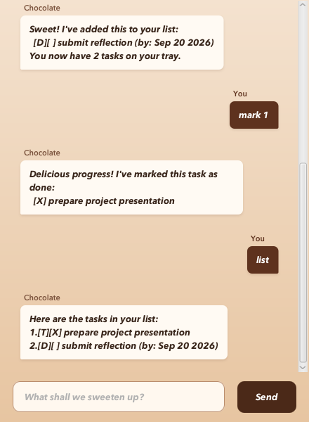

# Chocolate User Guide

Chocolate is a friendly task chocolatier that helps you keep track of todos, deadlines, and events. Add a task, check your list, and Chocolate keeps the details safely on your computer.



## Quick start

1. Install Java 25.
2. Download `Chocolate.jar` from this project.
3. In a terminal in the folder containing the JAR, run:

   ```bash
   java -jar Chocolate.jar
   ```

4. Type a command in the text box and press Enter or click **Send**.

Tasks are saved automatically in `data/duke.txt`. Use `bye` when you are finished.

## Commands

### Add a todo

Use `todo DESCRIPTION` for a task without a date.

Example: `todo prepare presentation slides`

### Add a deadline

Use `deadline DESCRIPTION /by YYYY-MM-DD` for work due on a date.

Example: `deadline submit reflection /by 2026-09-20`

### Add an event

Use `event DESCRIPTION /from START /to END` for an event with a start and end.

Example: `event project meeting /from Mon 2pm /to 4pm`

Event details can be ordinary text. If both values are dates in `YYYY-MM-DD` format, the end date must be later than the start date.

### View tasks

Use `list` to view every active task.

Use `find KEYWORD` to view tasks whose descriptions contain a keyword. Matching is not case-sensitive.

Example: `find presentation`

### Mark or unmark a task

Use `mark NUMBER` to mark a task as done, or `unmark NUMBER` to mark it as not done.

Examples: `mark 1`, `unmark 1`

Task numbers are the numbers displayed by `list` and start from 1.

### Delete a task

Use `delete NUMBER` to permanently remove an active task.

Example: `delete 2`

### Archive active tasks

Use `archive` to move every active task into Chocolate's archive and start with an empty active list. Archived tasks are kept in `data/archive.txt`.

Use `archive list` to view archived tasks.

### Exit Chocolate

Use `bye` to close the conversation.

## Tips and error messages

- Extra spaces before, after, or within a command are accepted.
- Each task must have a description. Duplicate active tasks are rejected.
- Use one `/by` for a deadline, and one `/from` plus one `/to` for an event.
- Chocolate explains invalid commands and keeps your existing tasks unchanged when an error occurs.
- If the saved task file is missing, Chocolate starts with an empty list.
